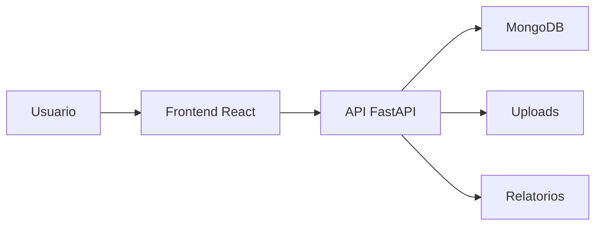

# GestaoEPI V5.1.0 NOVO 01

Sistema web para gestao de EPIs, colaboradores, empresas, estoque, entregas, kits, historico e relatorios, relacionado a uma versao mais recente da familia GestaoEPI.

## Visao Geral

O projeto organiza processos de entrega e acompanhamento de Equipamentos de Protecao Individual em uma aplicacao com frontend React, backend FastAPI e banco MongoDB. A estrutura indica evolucao de funcionalidades presentes em versoes anteriores do GestaoEPI.

## Problema Resolvido

O sistema atende a necessidade de controlar entregas de EPIs, manter historico por colaborador, organizar estoque e apoiar rotinas de seguranca do trabalho por meio de registros digitais.

## Principais Funcionalidades

### Funcionalidades Disponiveis

- Autenticacao de usuarios.
- Cadastro de empresas.
- Cadastro de colaboradores.
- Cadastro de EPIs.
- Cadastro de fornecedores.
- Kits de EPI.
- Entregas de EPI.
- Historico de entregas.
- Relatorios.
- Alertas e recursos de acompanhamento identificados na estrutura.
- Recursos relacionados a reconhecimento facial identificados no codigo e dependencias.

### Funcionalidades Em Desenvolvimento

- Ajustes de alertas, kits, NBR, periodicidade e rastreabilidade aparecem em arquivos e testes do projeto.

### Funcionalidades Planejadas

- Informacao nao confirmada no conteudo atual do repositorio.

## Como Funciona

```text
Usuario acessa o sistema
-> realiza login
-> cadastra dados operacionais
-> registra entregas e acompanha estoque
-> o backend valida e processa as solicitacoes
-> MongoDB armazena os registros
-> historicos, alertas e relatorios ficam disponiveis
```

## Tecnologias Utilizadas

- Python
- FastAPI
- MongoDB
- React
- Tailwind CSS
- face-api.js
- html5-qrcode
- ReportLab
- OpenPyXL

## Arquitetura



## Estrutura Do Projeto

- `backend/`: API, autenticacao, banco de dados, schemas, seeds, uploads e testes.
- `frontend/`: interface web, paginas e componentes.
- `memory/`, `memory_v509/` e `test_reports/`: artefatos existentes de acompanhamento.

## Status

Versao recente da familia GestaoEPI. Deve ser comparada com `GestorEPI-multiempresas-v5-9` para definicao do projeto principal no portfolio.

## Autor

Desenvolvido por Alexandre Santana dos Santos — Kalion Tecnologia

Perfil profissional: https://github.com/Tr3mbolon4
